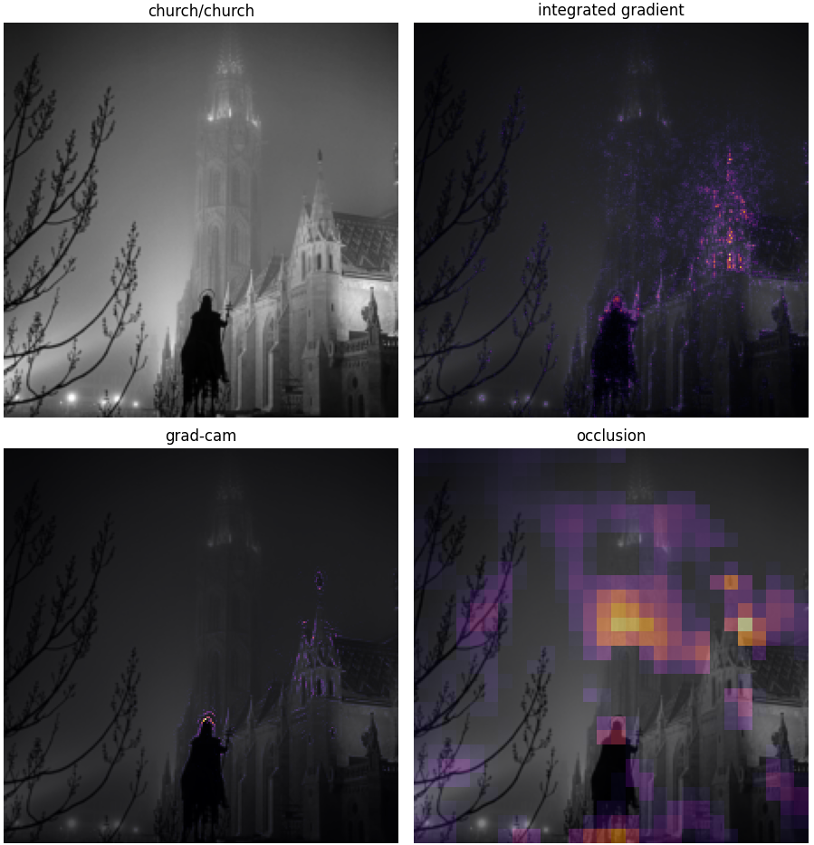

# XAI for CNNs: Explaining Image Classifiers

> **Master's Research Project** | Université de Lorraine (UFR MIM)

This repository contains the implementation and experimental analysis of post-hoc Explainable AI (XAI) methods applied to Convolutional Neural Networks (CNNs). The project explores how different interpretability techniques visualize the decision-making process of image classifiers, comparing a lightweight LeNet architecture on CIFAR-10 against a deeper ResNet-18 on the Imagenette dataset.

## Overview
Deep learning models, particularly CNNs, are often treated as "block boxes". This project investigates three distinct families of XAI methods to generate visual explanations (heatmaps) for model predictions:
1. **Attribution Methods**: Integrated Gradients (IG)
2. **Perturbation Methods**: Occlusion
3. **Activation Methods**: Guided Grad-CAM

The codebase includes custom training loops, dataset management, and a multiplexing visualization tool to compare the outputs of theses methodes side-by-side.

## XAI Methods Implemented

| Method | Family | Description |
| :--- | :--- | :--- |
| **Integrated Gradients** | Attribution | Axiomatic method that integrates gradients along a path from a baseline to the input. Avoids gradient saturation issues. |
| **Occlusion** | Perturbation | Agnostic method that slides a mask over the image and measures the drop in prediction confidence to identify critical regions. |
| **Guided Grad-CAM** | Activation | Combines Grad-CAM (class activation mapping) with Guided Backpropagation to produce high-resolution, semantically meaningful heatmaps. |

## Project Structure
```text
src/
├── helper/         # Utility functions (device management, tensor smoothing)
├── model/
│   ├── cifar10_lenet/  # LeNet implementation & CIFAR-10 data loading
│   └── resnet_imagenette.py  # ResNet-18 transfer learning pipeline
├── xai/            # Implementations of Captum-based XAI algorithms
└── text/           # LaTeX source code for the research report
```

## Illustration

